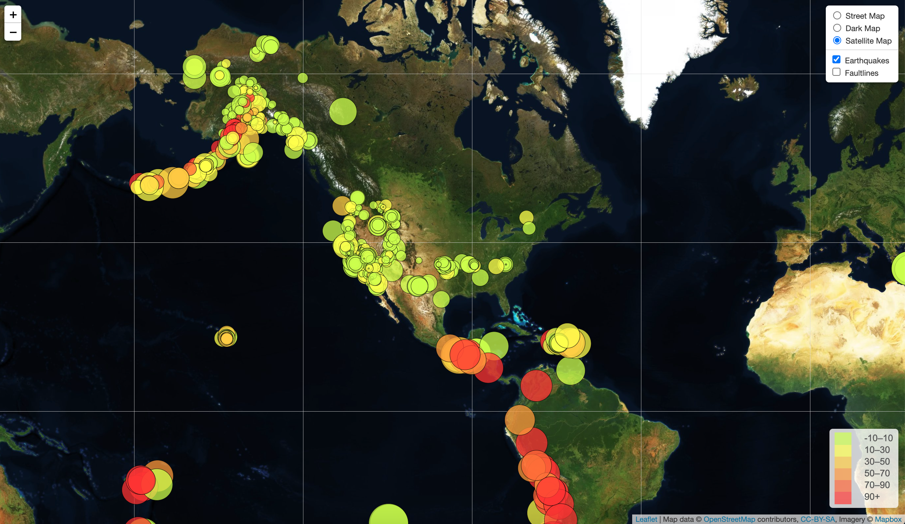
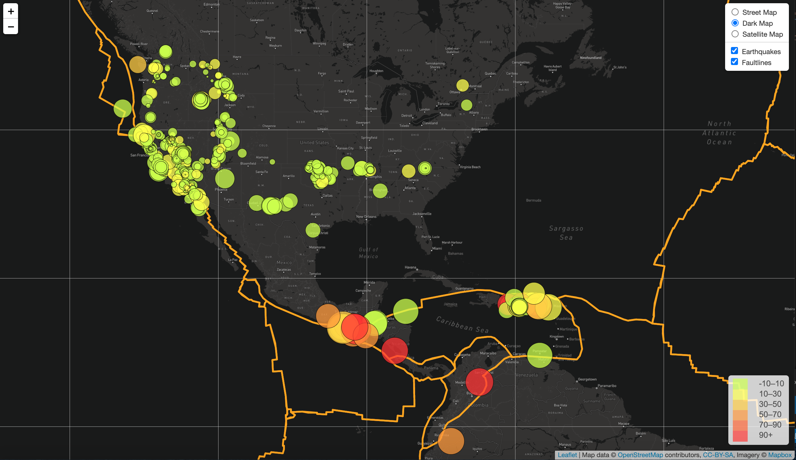

# Web Mapping - Visualizing Data with Leaflet

Created interactive map to visualize global earthquake information and with the option to compare with tectonic plate boundaries.

##

## Table of contents

* [Technologies](#technologies)
* [Installation](#installation)
* [Development Process](#development-process)
* [Data Sources](#data-sources)
* [Contact](#contact)

## Technologies

* Javascript:
  * Leaflet - version 1.6.0
  * d3 - version 4.2.3 & 4.5.0
* HTML
  * d3 cdn version 4.5.0 
* CSS
  * Leaflet - version 1.6.0
* Mapbox - version 1.12.0

## Installation and Usage
Installation: 
1. Link Leaflet CSS stylesheet in index header for map visualization and functionality.
2. Link d3 CDN script into index header for high-quality content with fast load speeds.
3. Link style.css into header of HTML for javascript styling.
4. Link Leaflet js script and d3 script into index body for javascript and leaflet functionality.
5. Reference static/js/logic.js in index body to connect to javascript file. 
6. Reference static/js/config.js in index of body to call and safely store Mapbox API key.
7. Update API key to working key for usage. 

Usage:
1. Overlay Features: select map option to change display map. Select Earthquakes and/or Faultlines features to visualize earthquake and tectonic plate data. 
2. Earthquake features: 
  * Legend: color legend details the depth of the earthquake epicenter. 
  * Radius displays magnitude.
  * Click on circle markers to see information on the time and location of the earthquake event.
3. Zoom Features: select plus or minus buttons in top left of map to zoom in and out.
4. Click and drag to move the map

## Development Process

1. Created map and overlay layer variables, then created a map variable and added layers to the map. Created legend and used the DomUtil function to add different grades within the legend. Looped through the grades and used the circleColor function to return proper colors with proper depths, then added to the map. 
2. Used d3.json to create the faultline layer, referencing github usercontent json data. The geoJSON function was used to add the faultlines layer. 
3. Used d3.json to query the USGS earthquake data and performed the following within the query:
 * Called the createFeatures function on data.features, then built functions within the query to build into the  createFeatures function:
  * styleInto function to style the circle markers, which calls the radiusSize and circleColor functions:
   * radiusSize is a function of magnitude, multiplied by 5 to display larger on the map
   * circleColor is a function of depth, with each range being assigned a different color that corresponds with the legend. 
  * Built the createFeatures function once the framework functions were complete:
  1. built onEachFeature to bind the html popup to circle markers with time and place of the earthquakes.
  2. Used geoJSON pointToLayer function to: 
 * return circle markers locations using latitude and longitude. 
 * call styleInto function to style circle markers.
 * call onEachFeature function to bind html popup to circle makers.
 * added to earthquake layer
  3. Added earthquakes to overlay map layer
 
 

## Data Sources
* Earthquake data sourced from US Geological Survey.
Retrieved from: [https://earthquake.usgs.gov/earthquakes/feed/v1.0/summary/all_week.geojson]
* Plate tectonic data source from Hugo Ahlenius, Github username fraxen.
Retrieved from: [https://raw.githubusercontent.com/fraxen/tectonicplates/master/GeoJSON/PB2002_plates.json]

## Contact
Created by [Katy Luquire](https://github.com/CatherineLuquire)
